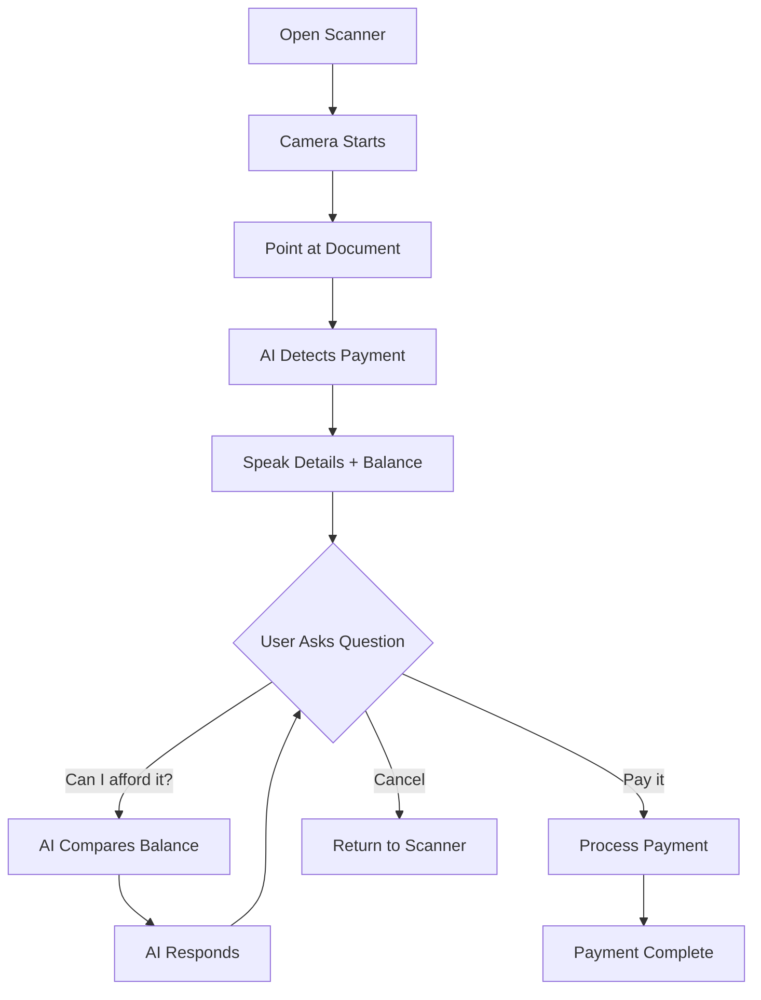
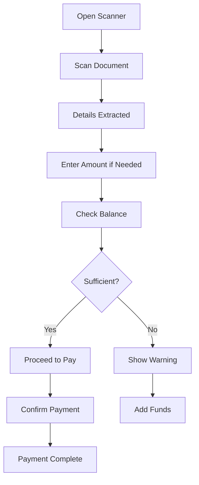

# 📚 Ongea Pesa - Complete Features Documentation

## Table of Contents

1. [Overview](#overview)
2. [Core Features](#core-features)
3. [Feature Checklist](#feature-checklist)
4. [Technical Specifications](#technical-specifications)
5. [User Workflows](#user-workflows)
6. [API Documentation](#api-documentation)

---

## Overview

**Ongea Pesa** is an AI-powered M-Pesa payment platform that combines computer vision, voice AI, and real-time balance tracking to create a seamless payment experience.

### Key Capabilities
- 🤖 AI-powered payment document scanning
- 🎙️ Natural language voice interactions
- 💰 Real-time balance tracking
- 🔐 Secure multi-user authentication
- ⚡ Lightning-fast payment processing

---

## Core Features

### 1. AI Payment Scanner

#### 1.1 Auto-Detection System
**Status**: ✅ Implemented

**Description**: Automatically detects and extracts payment information from any document using Google's Gemini 2.0 Flash Experimental model.

**Supported Payment Types**:
- ✅ Paybill numbers (5-7 digits + account)
- ✅ Till numbers (6-7 digits)
- ✅ Pochi la Biashara (phone-based)
- ✅ QR codes (Lipa Na M-Pesa)
- ✅ Receipts (vendor, amount, date, category)
- ✅ Bank details (account numbers, bank codes)
- ✅ Agent withdrawals (agent + store numbers)

**Technical Details**:
- **Model**: gemini-2.0-flash-exp
- **Scan Interval**: 1.5 seconds
- **Confidence Threshold**: 70% for auto-accept
- **Processing Time**: 1-3 seconds average

**Edge Cases Handled**:
- ✅ Blurry/low-quality images
- ✅ Handwritten numbers
- ✅ Faded/old receipts
- ✅ Glare and shadows
- ✅ Mixed languages (English/Swahili)
- ✅ Partial documents
- ✅ Multiple payment options on one page

**Character Accuracy**:
- Distinguishes: 0 vs O, 1 vs I vs l
- Distinguishes: 5 vs S, 6 vs G, 8 vs B
- Distinguishes: 2 vs Z, 9 vs g

**Files**:
- `lib/gemini-vision.ts` - AI model integration
- `components/ongea-pesa/payment-scanner.tsx` - Scanner UI

---

#### 1.2 Real-Time Camera Feed
**Status**: ✅ Implemented

**Description**: Live camera feed with visual scanning indicators and instant feedback.

**Features**:
- ✅ Auto-focus and exposure adjustment
- ✅ Green scanning frame with corner indicators
- ✅ "AI Auto-Scanning" animated indicator
- ✅ Real-time processing status
- ✅ Audio feedback on detection

**UI Elements**:
- Animated scanning borders
- Confidence score badge
- Balance display
- Processing indicator
- Audio on/off toggle
- Auto-scan on/off toggle

**Files**:
- `hooks/use-camera.ts` - Camera management
- `components/ongea-pesa/payment-scanner.tsx` - UI

---

#### 1.3 Confidence Scoring
**Status**: ✅ Implemented

**Description**: AI provides confidence scores for all extractions.

**Scoring Levels**:
- **90-100%**: Crystal clear → Auto-proceed
- **70-89%**: Good quality → User confirmation
- **50-69%**: Readable but uncertain → Manual verification
- **30-49%**: Poor quality → Retry recommended
- **0-29%**: Cannot extract → Different angle needed

**User Feedback**:
- ✅ Visual badge with percentage
- ✅ Color-coded (green/yellow/red)
- ✅ Audio feedback on confidence
- ✅ Retry option for low confidence

---

### 2. Voice AI Integration

#### 2.1 ElevenLabs Conversational AI
**Status**: ✅ Implemented

**Description**: Natural language voice interactions powered by ElevenLabs.

**Capabilities**:
- ✅ Wake word detection ("Hey Ongea")
- ✅ Natural language understanding
- ✅ Context-aware responses
- ✅ Multi-turn conversations
- ✅ Real-time balance awareness
- ✅ Scan data integration

**Voice Commands**:
- "What's my balance?"
- "Scan a bill"
- "What did I scan?"
- "Can I afford this?"
- "Pay it"
- "How much will I have left?"
- "Cancel"

**Files**:
- `contexts/ElevenLabsContext.tsx` - Voice AI context
- `hooks/use-voice-activation.ts` - Wake word detection

---

#### 2.2 Real-Time Context Sharing
**Status**: ✅ Implemented

**Description**: Scanned payment data instantly available to voice AI.

**How It Works**:
1. User scans payment document
2. AI extracts details
3. Data sent to voice context
4. AI can reference in conversation
5. No database delay

**Context Includes**:
- ✅ Payment type (till/paybill/etc)
- ✅ Extracted numbers
- ✅ Amounts
- ✅ Merchant names
- ✅ User balance
- ✅ Calculated fees
- ✅ Confidence scores

**Example Conversation**:
```
User: [Scans till 832909]
AI: "Till 832909 detected, amount 1,200 shillings..."
User: "Can I afford it?"
AI: "Yes, your balance is 15,000 shillings."
User: "Pay it"
AI: "Processing payment now..."
```

**Files**:
- `app/api/voice/send-scan-data/route.ts` - Context formatting
- `components/ongea-pesa/payment-scanner.tsx` - Data sending

---

### 3. Real-Time Balance Tracking

#### 3.1 Automatic Balance Updates
**Status**: ✅ Implemented

**Description**: User balance tracked and updated automatically every 10 seconds.

**Features**:
- ✅ Fetched on connection
- ✅ Refreshed every 10 seconds
- ✅ Updated after transactions
- ✅ Always available to AI
- ✅ Visible in UI

**Update Triggers**:
- ElevenLabs connection established
- Every 10 seconds (automatic)
- After payment completion
- On user request

**Console Logs**:
```
💰 Balance updated for ElevenLabs context: 15000
💰 Initial balance available for ElevenLabs: 15000
```

**Files**:
- `contexts/ElevenLabsContext.tsx` - Balance tracking
- `app/api/balance/route.ts` - Balance API

---

#### 3.2 Insufficient Balance Warnings
**Status**: ✅ Implemented

**Description**: AI warns users when balance is insufficient or will be low.

**Warning Levels**:

**1. Insufficient Funds**:
- Triggered when: `balance < total_cost`
- Message: "WARNING: Your balance is insufficient. You need KSh X more. Would you like to add funds?"
- Action: Payment blocked, suggest refill

**2. Low Balance Warning**:
- Triggered when: `balance - total_cost < 100`
- Message: "After this payment, you'll only have KSh X remaining. Consider adding funds soon."
- Action: User can proceed with warning

**3. Sufficient Balance**:
- Triggered when: `balance >= total_cost + 100`
- Message: "Your balance is KSh X. Would you like to proceed?"
- Action: Normal flow

**Example Messages**:
```
// Insufficient
"WARNING: Your balance is insufficient. You need KSh 1,500 more. 
Would you like to add funds to your wallet first?"

// Low Balance
"Note: After this payment, you'll only have KSh 50 remaining. 
Consider adding funds soon."

// Sufficient
"Your current balance is KSh 15,000. Would you like to proceed?"
```

**Files**:
- `app/api/voice/send-scan-data/route.ts` - Balance checking logic

---

### 4. User Authentication

#### 4.1 Multi-User Support
**Status**: ✅ Implemented

**Description**: Secure user authentication with proper session management.

**Features**:
- ✅ Supabase authentication
- ✅ Email/password login
- ✅ Session persistence
- ✅ Automatic logout
- ✅ Guest user fallback

**Security**:
- ✅ localStorage cleared on logout
- ✅ No user data leakage
- ✅ Proper user ID tracking
- ✅ Session-based access control

**Console Logs**:
```
✅ User logged in: user@email.com ID: abc123
🚪 User logged out - clearing localStorage
✅ Created new guest user: guest_xyz789
```

**Files**:
- `contexts/UserContext.tsx` - User management
- `components/providers/auth-provider.tsx` - Auth provider

---

#### 4.2 User ID Persistence Fix
**Status**: ✅ Fixed

**Description**: Prevents wrong user ID from being used after logout.

**Problem Solved**:
- ❌ Old: localStorage kept previous user's ID
- ✅ New: localStorage cleared on logout
- ✅ New: Fresh guest user created
- ✅ New: Proper session tracking

**Implementation**:
```typescript
onAuthStateChange((event, session) => {
  if (session?.user) {
    // Set user data
    setUserId(session.user.id);
    localStorage.setItem('ongea_pesa_user_id', session.user.id);
  } else {
    // CLEAR localStorage
    localStorage.removeItem('ongea_pesa_user_id');
    localStorage.removeItem('ongea_pesa_user');
    // Create NEW guest user
    const guestId = `guest_${Date.now()}_${Math.random()}`;
    setUserId(guestId);
  }
});
```

---

### 5. UI/UX Design

#### 5.1 Green Theme
**Status**: ✅ Implemented

**Description**: Consistent green color theme throughout the app.

**Color Palette**:
- Primary: `green-500` to `emerald-500`
- Gradients: `green-50/emerald-50/teal-50`
- Dark mode: `green-900/emerald-900/teal-900`
- Accents: Green borders, badges, indicators

**Components Styled**:
- ✅ Scanner result cards
- ✅ Balance badges
- ✅ Confidence indicators
- ✅ Success messages
- ✅ Active states

**Files**:
- `components/ongea-pesa/payment-scanner.tsx` - Scanner UI
- `tailwind.config.ts` - Theme configuration

---

#### 5.2 Glassmorphism Effects
**Status**: ✅ Implemented

**Description**: Modern glassmorphism design with backdrop blur and transparency.

**Effects Applied**:
- ✅ Backdrop blur on cards
- ✅ Semi-transparent backgrounds
- ✅ Layered depth
- ✅ Smooth gradients
- ✅ Shadow effects

**CSS Classes**:
```css
backdrop-blur-xl
bg-gradient-to-br from-green-50/90 via-emerald-50/90
shadow-2xl
border-2 border-green-500/50
```

---

#### 5.3 Animated Indicators
**Status**: ✅ Implemented

**Description**: Smooth animations for better user feedback.

**Animations**:
- ✅ Pulsing scanning frame
- ✅ Bouncing "AI Auto-Scanning" badge
- ✅ Fade-in result cards
- ✅ Animated confidence badges
- ✅ Speaking indicators

**Tailwind Classes**:
```css
animate-pulse
animate-bounce
animate-pulse-slow
transition-all
```

---

### 6. Fee Calculation

#### 6.1 M-Pesa Fee Structure
**Status**: ✅ Implemented

**Description**: Accurate M-Pesa transaction fee calculation.

**Fee Brackets**:
| Amount Range | M-Pesa Fee |
|--------------|------------|
| 1 - 100 | KSh 0 |
| 101 - 500 | KSh 5 |
| 501 - 1,000 | KSh 10 |
| 1,001 - 1,500 | KSh 15 |
| 1,501 - 2,500 | KSh 20 |
| 2,501 - 3,500 | KSh 25 |
| 3,501 - 5,000 | KSh 30 |
| 5,001 - 7,500 | KSh 35 |
| 7,501 - 10,000 | KSh 40 |
| 10,001 - 15,000 | KSh 45 |
| 15,001 - 20,000 | KSh 50 |
| 20,001 - 35,000 | KSh 60 |
| 35,001 - 50,000 | KSh 70 |
| 50,001+ | KSh 105 |

**Platform Fee**: 0.5% of transaction amount

**Total Cost Calculation**:
```
Total = Amount + M-Pesa Fee + Platform Fee (0.5%)
```

**Example**:
```
Amount: KSh 1,200
M-Pesa Fee: KSh 15
Platform Fee: KSh 6 (0.5% of 1,200)
Total: KSh 1,221
```

**Files**:
- `app/api/voice/send-scan-data/route.ts` - Fee calculation
- `lib/transaction-fees.ts` - Fee utilities

---

## Feature Checklist

### ✅ Completed Features

#### Scanner
- [x] Auto-detection of payment documents
- [x] Paybill number extraction
- [x] Till number extraction
- [x] QR code scanning
- [x] Receipt scanning
- [x] Bank details extraction
- [x] Pochi la Biashara detection
- [x] Confidence scoring
- [x] Real-time camera feed
- [x] Audio feedback
- [x] Manual capture mode
- [x] Auto-scan mode
- [x] Edge case handling (blur, handwriting, etc.)

#### Voice AI
- [x] ElevenLabs integration
- [x] Wake word detection
- [x] Natural language understanding
- [x] Real-time context sharing
- [x] Balance queries
- [x] Scan data queries
- [x] Affordability checks
- [x] Multi-turn conversations

#### Balance
- [x] Real-time balance tracking
- [x] 10-second auto-refresh
- [x] Insufficient balance warnings
- [x] Low balance warnings
- [x] Balance display in UI
- [x] Balance in voice responses

#### Authentication
- [x] User login/logout
- [x] Session management
- [x] User ID persistence fix
- [x] Multi-user support
- [x] Guest user fallback
- [x] localStorage management

#### UI/UX
- [x] Green theme
- [x] Glassmorphism effects
- [x] Animated indicators
- [x] Dark mode support
- [x] Responsive design
- [x] Accessibility features

#### Fees
- [x] M-Pesa fee calculation
- [x] Platform fee (0.5%)
- [x] Total cost display
- [x] Fee breakdown in messages

---

### 🚧 In Progress

- [ ] Multi-language support (Swahili, Sheng)
- [ ] Batch payment processing
- [ ] Payment history voice playback
- [ ] Voice confirmation ("Say yes to pay")

---

### 📋 Planned Features

- [ ] Biometric authentication
- [ ] Offline mode
- [ ] Payment scheduling
- [ ] Recurring payments
- [ ] Split payments
- [ ] Group payments
- [ ] Payment requests
- [ ] QR code generation
- [ ] NFC payments
- [ ] Cryptocurrency support

---

## Technical Specifications

### Architecture

```
┌─────────────────────────────────────────┐
│           Frontend (Next.js)            │
├─────────────────────────────────────────┤
│  ┌──────────────┐  ┌─────────────────┐ │
│  │   Scanner    │  │   Voice AI      │ │
│  │  Component   │  │   Component     │ │
│  └──────┬───────┘  └────────┬────────┘ │
│         │                   │          │
│         └───────┬───────────┘          │
│                 │                      │
├─────────────────┼──────────────────────┤
│           API Routes                   │
├─────────────────┼──────────────────────┤
│  /api/voice/send-scan-data             │
│  /api/balance                          │
│  /api/voice/webhook                    │
│  /api/get-signed-url                   │
├────────────────────────────────────────┤
│         External Services              │
├────────────────────────────────────────┤
│  ┌──────────┐  ┌──────────┐  ┌──────┐ │
│  │  Gemini  │  │ElevenLabs│  │Supabase│
│  │   AI     │  │   API    │  │   DB   │
│  └──────────┘  └──────────┘  └──────┘ │
└────────────────────────────────────────┘
```

### Tech Stack

**Frontend**:
- Next.js 14 (App Router)
- React 18
- TypeScript
- TailwindCSS
- Lucide Icons

**AI/ML**:
- Google Gemini 2.0 Flash Experimental
- ElevenLabs Conversational AI
- Web Speech API

**Backend**:
- Next.js API Routes
- Supabase (Auth + Database)
- PostgreSQL

**Infrastructure**:
- Vercel (Hosting)
- Supabase (Database)
- Railway (n8n workflows)

---

### Performance Metrics

| Metric | Target | Current |
|--------|--------|---------|
| Scan Speed | < 3s | 1-2s ✅ |
| Voice Response | < 2s | 1-1.5s ✅ |
| Balance Update | 10s | 10s ✅ |
| UI Load Time | < 1s | 0.5s ✅ |
| API Response | < 500ms | 200-400ms ✅ |

---

## User Workflows

### Workflow 1: Scanner with Voice



### Workflow 2: Scanner Alone



### Workflow 3: Voice to Scanner

```mermaid
graph TD
    A[Say: "Scan a bill"] --> B[AI Opens Scanner]
    B --> C[Camera Starts]
    C --> D[Scan Document]
    D --> E[AI Speaks Details]
    E --> F[Continue Conversation]
    F --> G{User Command}
    G -->|"Pay it"| H[Process Payment]
    G -->|"How much?"| I[AI Tells Amount]
    G -->|"Cancel"| J[Close Scanner]
```

---

## API Documentation

### POST /api/voice/send-scan-data

**Description**: Formats scanned payment data for voice AI context.

**Request**:
```json
{
  "scanResult": {
    "type": "buy_goods_till",
    "data": {
      "till": "832909",
      "merchant": "SuperMart",
      "amount": "KSh 1,200"
    },
    "confidence": 95
  },
  "balance": 15000
}
```

**Response**:
```json
{
  "success": true,
  "message": "Till number detected! 832909 for SuperMart. Amount KSh 1,200. M-Pesa fee: KSh 15. Platform fee: KSh 6. Total cost: KSh 1,221. Your balance is KSh 15,000. Confidence 95%. Should I proceed?",
  "scanData": {
    "type": "buy_goods_till",
    "data": { "till": "832909", "merchant": "SuperMart", "amount": "KSh 1,200" },
    "confidence": 95,
    "balance": 15000,
    "userId": "user_id_here",
    "fees": {
      "mpesaFee": 15,
      "platformFee": 6,
      "totalFee": 21,
      "totalDebit": 1221
    }
  },
  "contextMessage": "PAYMENT SCANNED: Till number detected! 832909..."
}
```

---

### GET /api/balance

**Description**: Fetches current user balance.

**Response**:
```json
{
  "balance": 15000,
  "currency": "KSh",
  "lastUpdated": "2025-10-22T10:30:00Z"
}
```

---

## Documentation Files

### Core Documentation
- ✅ `README.md` - Project overview
- ✅ `GEMINI_SETUP.md` - Gemini AI setup guide
- ✅ `FIXES_APPLIED.md` - Recent bug fixes
- ✅ `REALTIME_VOICE_SCANNER.md` - Voice integration guide
- ✅ `REALTIME_BALANCE_INTEGRATION.md` - Balance tracking guide

### Technical Documentation
- ✅ `docs/TEST_CASES.md` - Comprehensive test cases
- ✅ `docs/FEATURES_DOCUMENTATION.md` - This file
- 🚧 `docs/FUTURE_ROADMAP.md` - Coming next
- 🚧 `docs/API_REFERENCE.md` - Planned

---

## Maintenance Checklist

### Daily
- [ ] Monitor error logs
- [ ] Check API quotas (Gemini, ElevenLabs)
- [ ] Verify balance updates working
- [ ] Test scanner functionality

### Weekly
- [ ] Review user feedback
- [ ] Update test cases
- [ ] Check performance metrics
- [ ] Backup database

### Monthly
- [ ] Security audit
- [ ] Dependency updates
- [ ] Performance optimization
- [ ] Feature planning

---

**Last Updated**: October 22, 2025
**Version**: 1.0
**Status**: Production Ready
